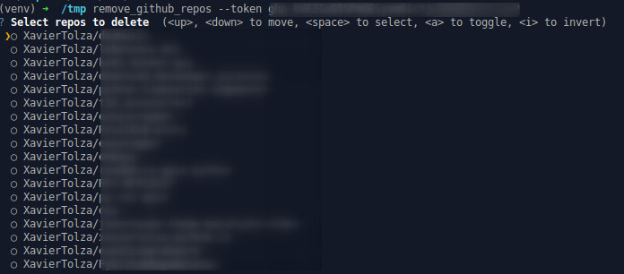

# About
This is just a very simple CLI to bulk delete github repositories

# Usage
Create your github token at this address: [https://github.com/settings/tokens](https://github.com/settings/tokens)
Make sure you have the `repo` and `delete_repo` authorizations. 

Install using
```
pip install git+https://github.com/XavierTolza/PyGithubRepoDeleter.git
```

Then start the CLI as such:
```
remove_github_repos
```

You will be prompted for your token, alternatively you can set it in the env variables with `GITHUB_TOKEN` or by command line with:
```bash
remove_github_repos --token <your token>
```

Then select the repo you want to delete with space, press enter and validate.